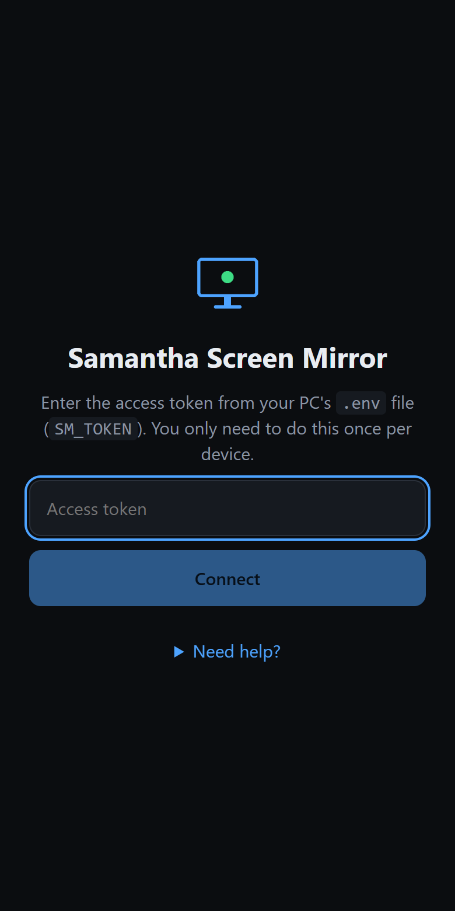
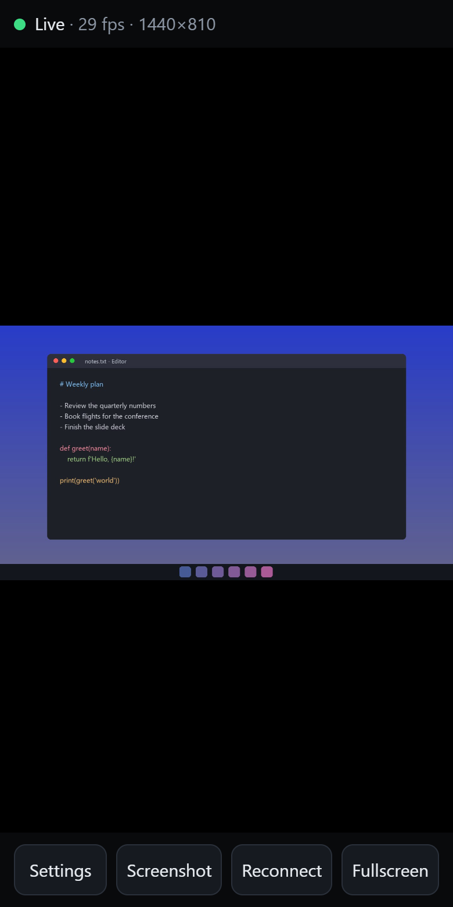
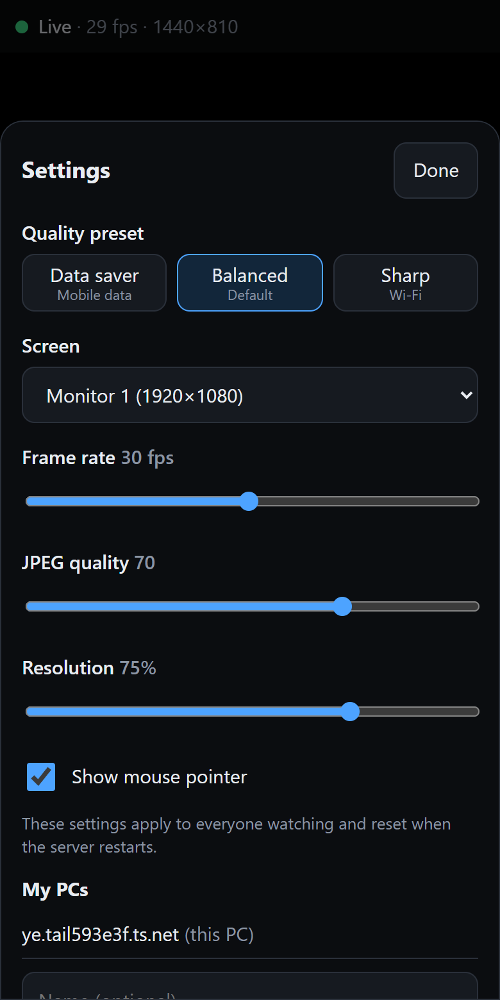

# Samantha Screen Mirror

See your Windows PC screen live on your phone, from anywhere, privately. No accounts, no cloud, no port forwarding:
the picture goes straight from your PC to your phone through your own [Tailscale](https://tailscale.com) network.

- **Installable app** (PWA) with pinch-zoom, screenshots, quality presets and a screen picker
- **Fast**: about 29 fps at 1440x810 and about 14 ms capture-to-send delay in testing (GPU capture)
- **Private**: only reachable inside your tailnet, protected by a secret token, **view-only**
- **Easy setup**: one script installs everything and shows a QR code for your phone

<p align="center">
  
  
  
</p>

*(Screenshots use a demo picture, not a real desktop.)*

> Status: early (v0.3). Windows only for now. View-only: you cannot control the PC from the phone.

## Quick start

You need: a Windows 10/11 PC, a phone (Android or iPhone), and a free Tailscale account.
The phone needs **no download from us**: it uses the free Tailscale app plus this app in its browser
(installable to the home screen). Only the PC needs the installer below.

### Option A: download (no Python, no PowerShell)

1. Download `SamanthaScreenMirror-windows.zip` from the [Releases](../../releases) page and unzip it somewhere permanent.
2. Double-click `samantha-mirror.exe` and follow the prompts. (Windows may warn about an unrecognised app because
   the program is not code-signed: choose *More info > Run anyway*.)
3. Do step 3 below on your phone.

### Option B: from source

1. **Get the code** (or download the ZIP and unpack it):
   ```powershell
   git clone https://github.com/SamaOmmy/samantha-screen-mirror
   cd samantha-screen-mirror
   ```
2. **Run the installer** in PowerShell:
   ```powershell
   .\install.ps1
   ```
   It installs Python if needed (with your permission), then guides you through:
   Tailscale (offers to install it) -> your secret token -> optional HTTPS -> start-at-logon -> a **QR code**.
3. **On your phone** (both options): install the free Tailscale app, sign in with the *same account* as the PC, switch it on,
   then scan the QR code. You are looking at your PC. Use the browser menu to **Install app**.

From then on, just open the app on your phone. The server starts by itself when you log in to Windows.

Lost the QR code? Run `samantha-mirror link` on the PC (see below).

## Commands

Run these in the project folder with the virtual environment, e.g. `.\.venv\Scripts\samantha-mirror.exe link`
(or activate it first with `.\.venv\Scripts\Activate.ps1`).

| Command | What it does |
|---|---|
| `samantha-mirror setup` | Guided first-time setup (safe to run again) |
| `samantha-mirror link` | Show the phone link and QR code |
| `samantha-mirror doctor` | Check everything and say how to fix problems |
| `samantha-mirror run` | Start the server in this window (Ctrl+C stops it) |
| `samantha-mirror autostart install/remove/status` | Start hidden at every Windows logon |
| `samantha-mirror uninstall` | Remove autostart and the HTTPS setup (keeps your settings) |

## How it works

```
phone (Tailscale app + browser/PWA)  --WireGuard-->  your PC: Samantha Screen Mirror
                                                        |- grabs the screen (DXGI GPU capture)
                                                        |- encodes JPEGs only when the picture changes
                                                        `- serves the app + stream, token required
```

- The server listens **only** on your Tailscale address (`100.x.y.z`); it refuses to start otherwise.
- Capture runs only while someone is watching.
- Optional HTTPS comes from `tailscale serve` (a Tailscale feature that stays inside your tailnet). It is what
  lets the phone offer a real **Install app**. Without it the app still works in the browser.

See [SECURITY.md](SECURITY.md) for the full threat model.

## Using the app

Tap the screen to show/hide the bars. Pinch to zoom, drag to pan, double-tap to reset.
**Settings** has presets (Data saver / Balanced / Sharp), a screen picker (multi-monitor), fps / quality /
resolution sliders and a pointer toggle. **Screenshot** saves a full-resolution PNG. The phone screen stays on while you watch.
**My PCs** (in Settings) bookmarks your other PCs so you can switch between them; each PC has its own address and
sign-in.

| Preset | Size | fps | Roughly (constant motion) |
|---|---|---|---|
| Data saver | 960x540 | 15 | 0.5 MB/s |
| Balanced (default) | 1440x810 | 30 | 3 MB/s |
| Sharp | 1920x1080 | 30 | 5 MB/s |

A still screen costs almost nothing because frames are only sent when something changes.

## Settings file

Created by `setup`: `%APPDATA%\SamanthaScreenMirror\.env` (or the project folder when you run from a checkout;
set `SM_HOME` to use another folder). Defaults are shown below; you rarely need to touch them.

| Variable | Default | Meaning |
|---|---|---|
| `SM_TOKEN` | generated | Access secret, min 16 chars. **Keep private.** |
| `SM_PORT` | 8787 | Port on the Tailscale address |
| `SM_MONITOR` | 1 | Monitor to start with (0 = all combined) |
| `SM_FPS` | 30 | Max frames per second (1-60) |
| `SM_JPEG_QUALITY` | 70 | 10-95 |
| `SM_SCALE` | 0.75 | 0.1-1.0 size of the stream |
| `SM_MAX_CLIENTS` | 3 | Max simultaneous viewers |
| `SM_CURSOR` | 1 | Draw the mouse pointer on the stream |
| `SM_CAPTURE` | auto | `auto` (DXGI, falls back to mss), `dxgi`, or `mss` |
| `SM_LOOPBACK` | 0 | Also listen on 127.0.0.1 (set by `setup` when you enable HTTPS) |

The app's Settings sheet changes fps / quality / size / screen live (shared by all viewers; reset on restart).

## Troubleshooting

Start with `samantha-mirror doctor`. Common causes:

- **Phone says "Can't reach your PC"**: Tailscale is off on the phone, or the PC is asleep / not signed in to Windows.
  Set Windows to never sleep while plugged in (Settings > System > Power).
- **"PC screen unavailable"**: the PC is locked or showing a secure prompt (UAC). It recovers when you unlock.
- **No "Install app" option**: you opened the plain `http://100.x...` address. Run `samantha-mirror setup`, enable
  HTTPS in your Tailscale admin console if asked, and use the `https://...ts.net` address.
- **Page does not load at all**: a Windows Firewall rule may be needed for the plain-HTTP address. In an
  Administrator PowerShell:
  ```powershell
  New-NetFirewallRule -DisplayName "Samantha Screen Mirror (Tailscale only)" -Direction Inbound `
    -Protocol TCP -LocalPort 8787 -RemoteAddress 100.64.0.0/10 -Action Allow
  ```
- **Choppy on mobile data**: pick the *Data saver* preset.

## Limitations

- Windows only (the capture and autostart code is Windows-specific). Ports to macOS/Linux are welcome.
- View-only **by design** (no remote control, now or later). No audio.
- The picture is a JPEG stream, not video. Unchanged frames cost nothing, so documents and desktops are very
  light; full-screen video or games over a slow connection will look choppy (use the *Data saver* preset).
  H.264 video was evaluated and left out on purpose: the good software encoder (x264) is GPL, which would change this
  project's MIT license for the downloadable build, and hardware encoders only exist on some GPUs.

## Development

See [CONTRIBUTING.md](CONTRIBUTING.md). Quick version: `pip install -e ".[dev]"`, then `ruff check .` and `pytest`.
The .exe download is built by CI when a version tag (e.g. `v0.3.0`) is pushed; locally:
`pip install pyinstaller` then `pyinstaller packaging/samantha.spec --noconfirm`.
The web app is React + Vite in `web/`; its build output in `samantha_mirror/web/` is committed.

```
samantha_mirror/
  cli.py        commands          wizard.py   guided setup + QR
  runner.py     start the server  doctor.py   health checks
  server.py     Flask routes      tailscale.py  find the address, HTTPS via tailscale serve
  capture.py    screen -> JPEG    autostart.py  Task Scheduler
  auth.py       token + lockout   config.py     settings
  web/          built web app (from web/)
web/            React + TypeScript source
packaging/      PyInstaller spec for the Windows .exe download
tests/          pytest
```

## License

[MIT](LICENSE)
